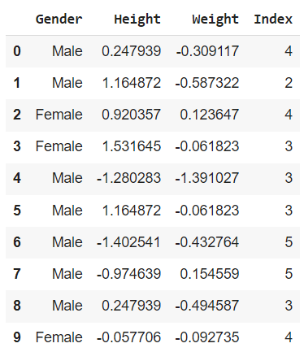
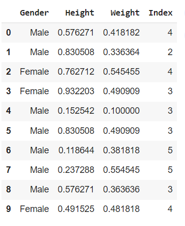
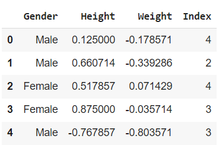

# EXNO:4-Feature Scaling and Selection

# AIM:
To read the given data and perform Feature Scaling and Feature Selection process and save the
data to a file.

# ALGORITHM:
STEP 1:Read the given Data.

STEP 2:Clean the Data Set using Data Cleaning Process.

STEP 3:Apply Feature Scaling for the feature in the data set.

STEP 4:Apply Feature Selection for the feature in the data set.

STEP 5:Save the data to the file.

# FEATURE SCALING:
1. Standard Scaler:
It is also called Z-score normalization. It calculates the z-score of each value and replaces the value with the calculated Z-score. The features are then rescaled with x̄ =0 and σ=1
 
2. MinMaxScaler:
It is also referred to as Normalization. The features are scaled between 0 and 1. Here, the mean value remains same as in Standardization, that is,0.
 
3. Maximum absolute scaling:
Maximum absolute scaling scales the data to its maximum value; that is,it divides every observation by the maximum value of the variable.The result of the preceding transformation is a distribution in which the values vary approximately within the range of -1 to 1.
 
4. RobustScaler:
RobustScaler transforms the feature vector by subtracting the median and then dividing by the interquartile range (75% value — 25% value).
 

# FEATURE SELECTION:
Feature selection is to find the best set of features that allows one to build useful models. Selecting the best features helps the model to perform well.
The feature selection techniques used are:

1.Filter Method

2.Wrapper Method

3.Embedded Method

# CODING AND OUTPUT:
```
NAME : ARAVINDHNATH R
REGISTER NUMBER : 212222100005
```
## FEATURE SCALING:
```
import pandas as pd
from scipy import stats
import numpy as np
df=pd.read_csv("/content/bmi.csv")
df.head()
df.dropna()
max_vals = np.max(np.abs(df[['Height','Weight']]))
max_vals
```


### STANDARD SCALING
```
df1=pd.read_csv("/content/bmi.csv")
from sklearn.preprocessing import StandardScaler
sc=StandardScaler()
df1[['Height','Weight']]=sc.fit_transform(df1[['Height','Weight']])
df1.head(10)
```


### MIN-MAX SCALING:
```
from sklearn.preprocessing import MinMaxScaler
scaler=MinMaxScaler()
df[['Height','Weight']]=scaler.fit_transform(df[['Height','Weight']])
df.head(10)
```


### MAXIMUM ABSOLUTE SCALING:
```
df3=pd.read_csv("/content/bmi.csv")
from sklearn.preprocessing import MaxAbsScaler
scaler = MaxAbsScaler()
df3[['Height','Weight']]=scaler.fit_transform(df3[['Height','Weight']])
df3
```


### ROBUST SCALING:
```
df4=pd.read_csv("/content/bmi.csv")
from sklearn.preprocessing import RobustScaler
scaler = RobustScaler()
df4[['Height','Weight']]=scaler.fit_transform(df4[['Height','Weight']])
df4.head()
```


### The best feature scaling methods for 'bmi' dataset could be MinMax Scaling.MinMax Scaling scales the data to a fixed range, preserving the original range of the data.While MinMax Scaling is sensitive to outliers, it can still be effective if your dataset does not contain extreme outliers.
## FEATURE SELECTION:
```
import pandas as pd
df=pd.read_csv("/content/income(1) (1).csv",na_values=[" ?"])
df=df.dropna(axis=0)
df
```


### FILTER METHOD:
```
import pandas as pd
from sklearn.feature_selection import SelectKBest, chi2, f_classif
categorical_columns = ['JobType', 'EdType', 'maritalstatus', 'occupation', 'relationship', 'race', 'gender', 'nativecountry']
df[categorical_columns] = df[categorical_columns].astype('category')
df[categorical_columns] = df[categorical_columns].apply(lambda x: x.cat.codes)
X = df.drop(columns=['SalStat'])
y = df['SalStat']
k_chi2 = 5
selector_chi2 = SelectKBest(score_func=chi2, k=k_chi2)
X_chi2 = selector_chi2.fit_transform(X, y)
k_anova = 5  
selector_anova = SelectKBest(score_func=f_classif, k=k_anova)
X_anova = selector_anova.fit_transform(X, y)
selected_features_chi2 = X.columns[selector_chi2.get_support()]
selected_features_anova = X.columns[selector_anova.get_support()]
print("Selected features using chi-square test:")
print(selected_features_chi2)
print("\nSelected features using ANOVA:")
print(selected_features_anova)
```


### WRAPPER METHOD:
```
import pandas as pd
from sklearn.feature_selection import RFE
from sklearn.linear_model import LogisticRegression
categorical_columns = ['JobType', 'EdType', 'maritalstatus', 'occupation', 'relationship', 'race', 'gender', 'nativecountry']
df[categorical_columns] = df[categorical_columns].astype('category')
df[categorical_columns] = df[categorical_columns].apply(lambda x: x.cat.codes)
X = df.drop(columns=['SalStat'])
y = df['SalStat']
logreg = LogisticRegression()
n_features_to_select = 5
rfe = RFE(estimator=logreg, n_features_to_select=n_features_to_select)
rfe.fit(X, y)
selected_features = X.columns[rfe.support_]
print("Selected features using RFE:")
print(selected_features)
```


### EMBEDDED METHOD:
```
import pandas as pd
from sklearn.linear_model import LogisticRegression
from sklearn.feature_selection import SelectFromModeL
categorical_columns = ['JobType', 'EdType', 'maritalstatus', 'occupation', 'relationship', 'race', 'gender', 'nativecountry']
df[categorical_columns] = df[categorical_columns].astype('category')
df[categorical_columns] = df[categorical_columns].apply(lambda x: x.cat.codes)
X = df.drop(columns=['SalStat'])
y = df['SalStat']
logreg_l1 = LogisticRegression(penalty='l1', solver='liblinear', C=1.0)
selector = SelectFromModel(estimator=logreg_l1, threshold=None)
selector.fit(X, y)
selected_features_indices = selector.get_support(indices=True)
selected_features = X.columns[selected_features_indices]
print("Selected features using embedded method (Lasso regularization):")
print(selected_features)
```


###   For this 'income' dataset, Embedded Method is best for feature selection.Embedded methods provide feature importance scores directly within the context of the chosen model. Embedded methods automatically select relevant features during model training, which can be beneficial for reducing overfitting and improving generalization performance
# RESULT:

Thus, Feature selection and Feature scaling has been performed using the given dataset.
